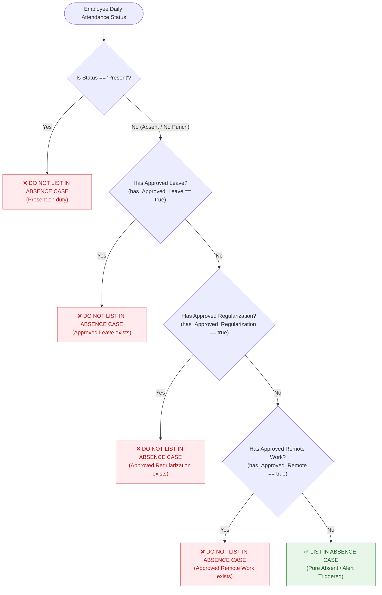

# Absence Case Listing Validation & Business Specification

## 1. Overview & Objective

This document formalizes the business logic, API validation rules, decision tree, and automated test design for the **HR Lens Absence Case Module**.

The primary objective is to ensure that employees are **only listed in Absence Cases** when they have an unauthorized absence with no valid attendance, approved leave, approved regularization, or approved remote work.

---

## 2. API Endpoints

### 2.1 Absence Case Endpoints
- **Single Case Details**: 
  - `GET https://audit.jobvritta.com/api/AbsenceCase/{id}` (Stage)
  - `GET https://hrmsapi.jobvritta.com/api/AbsenceCase/{id}` (Prod)
- **Absence Cases List**: 
  - `GET https://audit.jobvritta.com/api/AbsenceCase/list?lazyParams={"first":0,"rows":500,"page":0}&search=&status=`
  - `GET https://hrmsapi.jobvritta.com/api/AbsenceCase/list`

### 2.2 Correlating Attendance & Request Endpoints
- **Attendance Summary**: `GET /api/Hrlense_Attendance/employee-attendance-summary?from=YYYY-MM-DD&to=YYYY-MM-DD`
- **Leave Requests**: `GET /api/Hrlense_Leave/LeaveRequests`
- **Regularization Requests**: `GET /api/Regularization/regularization`
- **Remote Work Requests**: `GET /api/Remote/remote`

---

## 3. Visibility & Listing Rules

### 3.1 Exclude Rule (Do NOT List)
An employee record must **NOT** appear in the Absence Case list if **ANY** of the following conditions are met:
1. `status == 'Present'` (Employee was present at work / attendance punch recorded).
2. `has_Approved_Leave == true` (Employee has an approved leave for the date).
3. `has_Approved_Regularization == true` (Employee's attendance regularization was approved by manager).
4. `has_Approved_Remote == true` (Employee has approved Work From Home / Remote duty).

### 3.2 Include Rule (Must List)
An employee record must be **LISTED** in the Absence Case list **ONLY IF ALL** of the above conditions are false:
- `status != 'Present'` **AND**
- `has_Approved_Leave == false` **AND**
- `has_Approved_Regularization == false` **AND**
- `has_Approved_Remote == false`

---

## 4. Formal Decision Logic

```text
Condition:
(status == 'Present') OR (has_Approved_Leave == true) OR (has_Approved_Regularization == true) OR (has_Approved_Remote == true)

- If TRUE  -> Do NOT display the record in Absence Case ("Not Listed")
- If FALSE -> Display the record in Absence Case ("Listed")
```

---

## 5. Flowchart & Decision Tree



---

## 6. Business Validation Scenarios Matrix

| Scenario # | Attendance Status | Approved Leave | Approved Regularization | Approved Remote | System Decision | Expected Listing Result |
| :---: | :---: | :---: | :---: | :---: | :---: | :---: |
| **1** | `Present` | `false` | `false` | `false` | Present on duty | **Not Listed** |
| **2** | `Absent` | `true` | `false` | `false` | Authorized leave | **Not Listed** |
| **3** | `Absent` | `false` | `true` | `false` | Regularized by Manager | **Not Listed** |
| **4** | `Absent` | `false` | `false` | `true` | Working remotely (WFH) | **Not Listed** |
| **5** | `Absent` | `false` | `false` | `false` | **Unauthorized / Pure Absent** | **✅ Listed** |

---

## 7. Automated Implementation & Architecture

### 7.1 Framework Structure

| Layer | Component | File Path |
| :--- | :--- | :--- |
| **API Helper** | Absence API Operations | [`utils/api/absence_api.py`](file:///c:/Users/User/Desktop/Tekinspirations/HRlens_Playwright/utils/api/absence_api.py) |
| **Validation Suite** | Business Logic & Rules Audit | [`tests/hrlense_portal/api/test_absence_case_listing_validation.py`](file:///c:/Users/User/Desktop/Tekinspirations/HRlens_Playwright/tests/hrlense_portal/api/test_absence_case_listing_validation.py) |
| **Tally Report** | Absence vs Attendance Summary | [`tests/hrlense_portal/api/test_tally_absence_attendance.py`](file:///c:/Users/User/Desktop/Tekinspirations/HRlens_Playwright/tests/hrlense_portal/api/test_tally_absence_attendance.py) |
| **Export Formats** | Automated Excel & Markdown Reports | [`reports/absence_details.xlsx`](file:///c:/Users/User/Desktop/Tekinspirations/HRlens_Playwright/reports/absence_details.xlsx) |

### 7.2 Running the Validation Suite

```powershell
# Run the complete absence case listing validation suite
.\venv\Scripts\pytest tests/hrlense_portal/api/test_absence_case_listing_validation.py -v --log-cli-level=INFO

# Run single case record verification (e.g. Case 1116)
.\venv\Scripts\pytest tests/hrlense_portal/api/test_absence_case_listing_validation.py -k test_absence_case_single_record_api -s -v

# Run full live API compliance audit
.\venv\Scripts\pytest tests/hrlense_portal/api/test_absence_case_listing_validation.py -k test_audit_live_absence_case_list_rules -s -v
```

---

## 8. Environment Configuration

The test suite automatically adapts based on the active `ENV` configured in [`.env`](file:///c:/Users/User/Desktop/Tekinspirations/HRlens_Playwright/.env):

```ini
# For Staging:
ENV=stg
# Base URL: https://stg-hrlense.jobvritta.com | API: https://audit.jobvritta.com/api

# For Production:
ENV=prod
# Base URL: https://www.hrlense.com | API: https://hrmsapi.jobvritta.com/api
```
